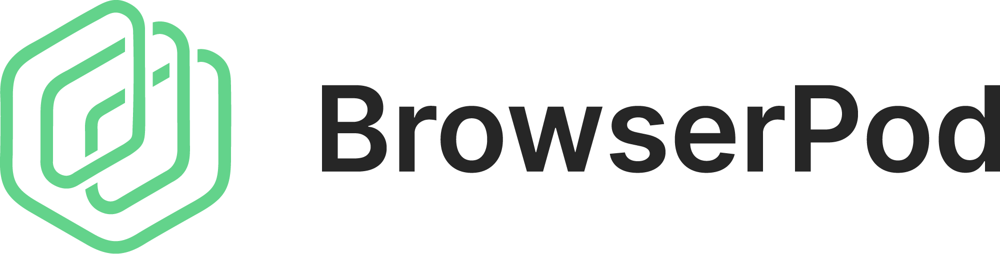

<h1>
<picture>
  <source srcset="assets/logotype-white-text.png" media="(prefers-color-scheme: dark)">
  <source srcset="assets/logotype-black-text.png" media="(prefers-color-scheme: light)">
</h1>
</picture>

**BrowserPod** is a **sandbox API** that provides in-browser runtimes for common backend languages, libraries and frameworks. Run Node.js projects directly in the browser, unmodified. No installation or cloud provisioning required.

[BrowserPod.io](https://browserpod.io) • [Documentation](https://browserpod.io/docs) • [Demos](https://browserpod.io/docs/demos) • [Discord](https://discord.leaningtech.com) • [Svelte Component Library](https://github.com/leaningtech/svelte-browserpod-editor)

## What is BrowserPod?

BrowserPod runs language runtimes compiled to WebAssembly inside a browser tab. Each **Pod** is an isolated instance with:

- **Real language runtimes** running client-side at native speed (Node.js available now, Python and Ruby coming soon)
- A **block-based streaming virtual filesystem** with familiar file and directory behavior
- **Portals** that expose local servers at public URLs
- Browser sandbox security—isolated from the user's OS

Everything runs client-side within the browser, so users don't need to install anything.

## Use Cases

- **Execute untrusted code safely**: Run user-provided code for AI agents or automation in a contained environment
- **Live product demos**: Ship demos that run real backend logic without infrastructure
- **Interactive tutorials**: Let users run actual servers and see responses while learning
- **Collaborative tools**: Build multi-user apps that run locally and sync via portals
- **Browser-based "server" functions**: Run tasks that typically need cloud provisioning, like HTTP requests or API calls, entirely client-side

## Quick Start

Get started with the [quickstart guide](https://browserpod.io/docs/getting-started) or the [Express.js tutorial](https://browserpod.io/docs/tutorials/expressjs).

## Resources

- **[Documentation](https://browserpod.io/docs)** - Complete guides, tutorials, and API reference
- **[Svelte Component Library](https://github.com/leaningtech/svelte-browserpod-editor)** - Pre-built UI components for BrowserPod editors
- **[Discord Community](https://discord.leaningtech.com)** - Get help and share your projects
- **[GitHub Issues](https://github.com/leaningtech/browserpod-meta/issues)** - Report bugs and request features

## Licensing

BrowserPod is proprietary software and it's free to use only for personal and open-source projects. Commercial support, feature fast tracking, sponsored development and consulting packages are available for Enterprise customers.

See the [pricing policy](https://browserpod.io/browserpod-pricing-policy) for details or [contact us](https://forms.leaningtech.com/leaningforms/form/BookaDemo/formperma/2zFTrXkIeE0kW_6tyq1wbmbWM0Jf8s6Tft4ot0waF0Q) for Enterprise options.
