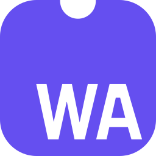
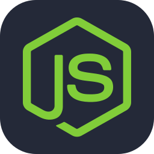
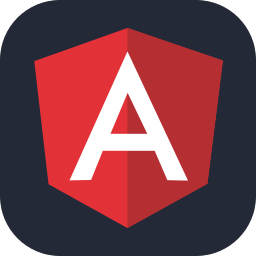
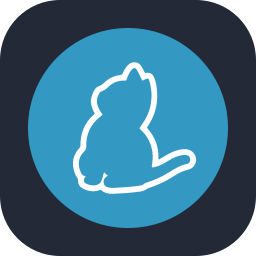

<p align="center">
  <a href="https://browserpod.io">BrowserPod.io</a>
  &nbsp;•&nbsp;
  <a href="https://browserpod.io/docs">Docs</a>
  &nbsp;•&nbsp;
  <a href="https://browserpod.io/docs">Claude Code</a>
  &nbsp;•&nbsp;
  <a href="https://discord.leaningtech.com">Discord</a>
</p>

<h3 align="center">
  
  <br>
  BrowserPod
</h3>

<p align="center">
  <a href="https://discord.leaningtech.com"></a>
  <a href="https://github.com/leaningtech/browserpod-meta/issues"></a>
  <a href="https://npm.im/browserpod"></a>
</p>

<p align="center">
  
  &nbsp;&nbsp;
  
  &nbsp;&nbsp;
  
  &nbsp;&nbsp;
  
  &nbsp;&nbsp;
  
  &nbsp;&nbsp;
  
  &nbsp;&nbsp;
  
  &nbsp;&nbsp;
  
  &nbsp;&nbsp;
  
  &nbsp;&nbsp;
  
  &nbsp;&nbsp;
  
  &nbsp;&nbsp;
  
  &nbsp;&nbsp;
  
  &nbsp;&nbsp;
  
  &nbsp;&nbsp;
  
  &nbsp;&nbsp;
  
  &nbsp;&nbsp;
  
  &nbsp;&nbsp;
  
  &nbsp;&nbsp;
  

</p>

## What is BrowserPod?

BrowserPod is a WebAssembly-based API that creates a lightweight Linux virtual machine directly in a user's browser tab. BrowserPod's in-browser Linux kernel supports sandboxed runtime environments including **Node.js**, **Rust** and **Python (preview)**, with more coming soon.

Developers use BrowserPod to **sandbox untrusted and AI-generated code** in the browser, build web applications that **embed server-side processes client-side**, **create interactive documentation and playgrounds** and **run AI coding CLIs in-browser** without modification (e.g., Claude Code, Codex).
<br>

## Features
|   |  |
| --- | --- |
| **Kernel** | BrowserPod compiles full native runtimes to WebAssembly, targeting a Linux-compliant syscall interface rather than a limited JavaScript shim. |
| **Sandbox** | BrowserPod runs directly in the browser, inheriting its security boundary, with additional cross-origin isolation. |
| **Runtimes** | In-browser runtimes for Node.js, Rust and Python (currently in preview). Ruby and Go are in development. |
| **Compatibility** | The Node.js runtime ships with npm and Vite built in, and supports most frameworks (including React, Angular, Next.js and Express.js; see Node.js frameworks for more). Rust launches with jj, and more tools are coming to both the Rust and Python runtimes. |
| **Filesystem** | A block-based streaming virtual filesystem provides full POSIX compatibility. Disk images are streamed on demand, and any file changes stay local to the browser session using either IndexedDB or the Origin Private File System (OPFS). |
| **Portals** | Ports that open in BrowserPod can be shared via a temporary private URL. This secure URL routes external traffic directly to the service running in the browser, enabling live previews and collaboration without any backend servers. |
| **Tools** | BrowserPod provides a wide range of developer tools, functions and frameworks, including bash and git, plus npm for Node.js and jj for Rust. |
| **Multithreading** | Web workers enable true multithreading and process isolation for complex, multi-process workloads that would normally require a full operating system. |

<br>

## Getting started

### Quickstart

```
npm create browserpod-quickstart
```

### npm

```
npm install @leaningtech/browserpod
```

### yarn

```
yarn add @leaningtech/browserpod
```

- **[Read our detailed getting started guide](https://browserpod.io/docs/getting-started/quickstart)**

## Runtimes

BrowserPod supports Node.js and Rust, with Python currently in preview. Additional runtimes, including Go and Ruby, are in development.

| Runtime  | Availability | Version |
| ------------- | :------------- | :------------- |
| Node.js | Live 🟢 | 22.15.0 |
| Rust | Live 🟢 | 1.97.0 nightly |
| Python | Preview 🟠 | 3.12.11 |
| Go | 2026 🔴 | TBA |
| Ruby | 2026 🔴 | TBA |

## Requirements

### Browser

Chrome, Firefox, Edge and Safari are all supported. For maximum compatibility, we recommend Chromium-based browsers.

In some experimental use cases that require significant client memory, BrowserPod may fail in Safari.

### Terminal

BrowserPod requires a terminal to run. A terminal is an opaque handle to a terminal emulator running inside a BrowserPod instance, created by `createDefaultTerminal` or `createCustomTerminal` and passed to `run` to connect a process to I/O.

BrowserPod uses xterm.js, but also supports other Wasm-compatible pseudo-terminals (e.g., ghosttyweb). 

### Networking

BrowserPod provides controlled networking. To prevent malicious use, egress is limited to a whitelist of domains (e.g., github.com). To add domains for your project, reach out to us on Discord.

### Native binaries

BrowserPod runs Node.js in a Wasm environment. Packages that ship native binaries for specific CPU architectures will not run unless they provide a Wasm build.

Many popular build tools publish an official Wasm version alongside the native one. You can tell your package manager to install the Wasm version instead, anywhere in your dependency tree, without changing your own code.

#### Common Wasm overrides

| Native package | Replace with | What it does |
| --- | --- | --- |
| `esbuild` | `npm:esbuild-wasm@*` | Bundler used by Vite and many dev servers |
| `rollup` | `npm:@rollup/wasm-node@*` | Bundler used by Vite for production builds |
| `@parcel/watcher` | `npm:@parcel/watcher-wasm@*` | Watches files for changes during development |

Add them under `overrides` in your `package.json`:

```json
{
  "overrides": {
    "esbuild": "npm:esbuild-wasm@*",
    "rollup": "npm:@rollup/wasm-node@*",
    "@parcel/watcher": "npm:@parcel/watcher-wasm@*"
  }
}
```

If you use Yarn, the field is called `resolutions` instead of `overrides`. The contents are the same.

#### Framework-specific packages

Some frameworks ship their Wasm build as a separate package that you add as a normal dependency, rather than as an override:

| Package | Needed for |
| --- | --- |
| `@next/swc-wasm-nodejs` | Wasm build of the SWC compiler used by Next.js |
| `@oxc-minify/binding-wasm32-wasi` | Minifier for Nuxt and other Oxc-based toolchains |
| `@oxc-parser/binding-wasm32-wasi` | Parser for Nuxt and other Oxc-based toolchains |
| `@oxc-transform/binding-wasm32-wasi` | Transformer for Nuxt and other Oxc-based toolchains |

### Cross-origin isolation

BrowserPod uses `SharedArrayBuffer`, which means it can only run on cross-origin isolated pages.

To enable **cross-origin isolation**, your page must send both of these headers:

```
Cross-Origin-Opener-Policy: same-origin
Cross-Origin-Embedder-Policy: require-corp
```

- **[Learn more about cross-origin isolation](https://browserpod.io/docs/understanding-browserpod/cross-origin-isolation)**

## Resources

- **[Documentation](https://browserpod.io/docs)**: Complete guides, tutorials, and API reference
- **[Showcase](https://browserpod.io/showcase/)**: Community projects built on BrowserPod
- **[Discord Community](https://discord.leaningtech.com)**: Get help and share your projects
- **[GitHub Issues](https://github.com/leaningtech/browserpod-meta/issues)**: Report bugs and request features
- **[Yarn 6 playground](https://v6.yarnpkg.com)**: Yarn 6 runs on BrowserPod in its official playground. 

<br>

## Licensing

BrowserPod is proprietary software. It's free to use for personal and open-source projects.

Commercial support, feature fast-tracking, sponsored development and consulting packages are available for Enterprise customers.

Generous token grants are available for start-ups and open-source projects.

See our [pricing](https://browserpod.io/browserpod-pricing-policy) for more details or [contact us](https://browserpod.io/contact/) if you've got questions.
